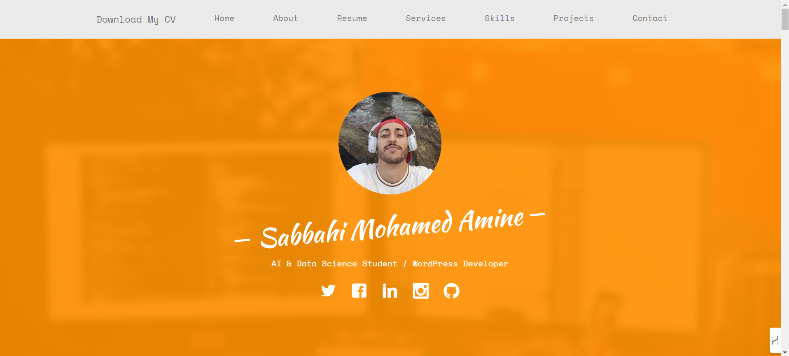

# Mohamed Amine Sabbahi's Portfolio

Welcome to my portfolio! This project showcases my skills and projects in web development using HTML, CSS, JavaScript, jQuery, and Bootstrap.



## Live view

You can view the live portfolio <a href="https://amine-sabbahi.github.io/portfolio" target="_blank">here</a>.

## Features

- **Responsive Design**: The portfolio is designed to be responsive and accessible on various devices.
- **Interactive Elements**: Using JavaScript and jQuery, the portfolio includes interactive elements to enhance user experience.
- **Styled with Bootstrap**: Leveraging Bootstrap, the design is clean and modern.
- **Project Showcase**: Detailed sections for each of my projects with links to the live demos and source code.

## Technologies Used

- **HTML**: For structuring the content.
- **CSS**: For styling the content.
- **JavaScript**: For interactive functionality.
- **jQuery**: For simplified JavaScript programming.
- **Bootstrap**: For responsive design and prebuilt components.

## How to Use the same template

To run this portfolio locally, follow these steps:

1. Clone the repository:
    ```sh
    git clone https://github.com/amine-sabbahi/amine-sabbahi.github.io.git
    ```
2. Navigate to the project directory:
    ```sh
    cd amine-sabbahi.github.io/portfolio
    ```
3. Open `index.html` in your web browser to view the portfolio.
